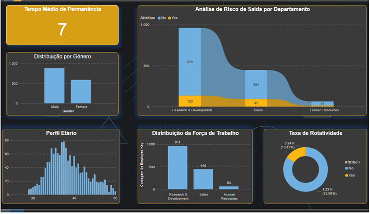
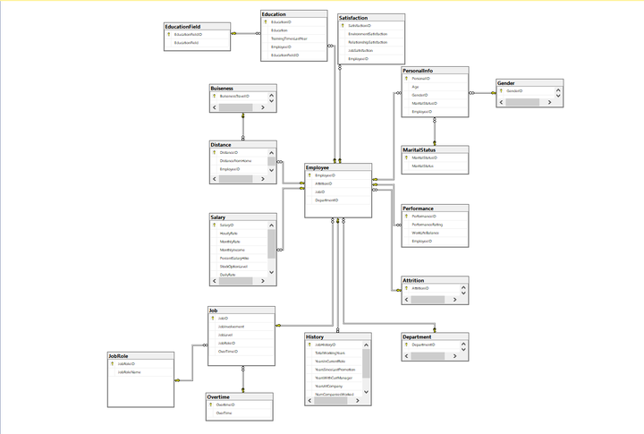
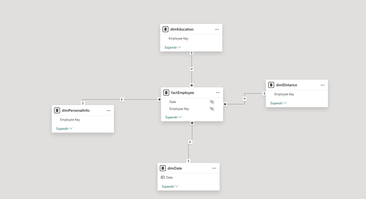
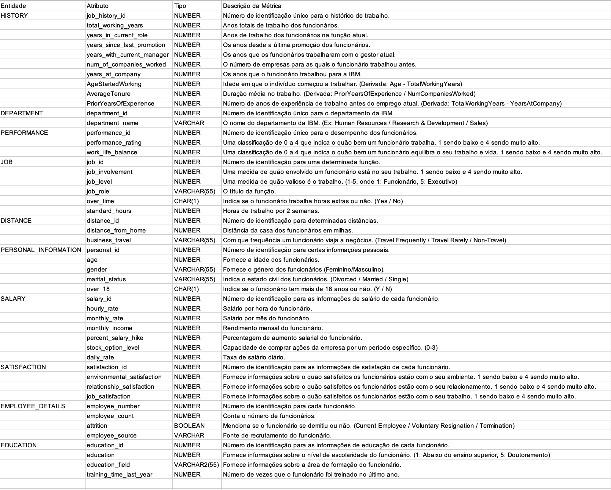
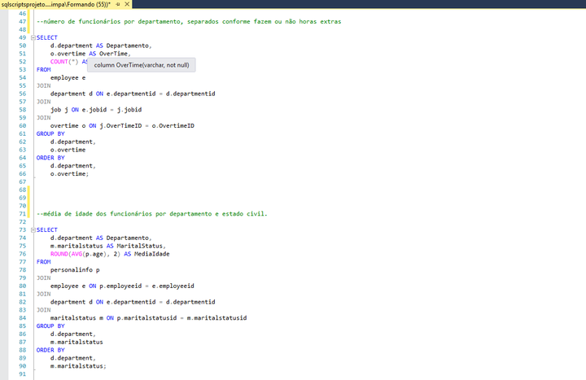
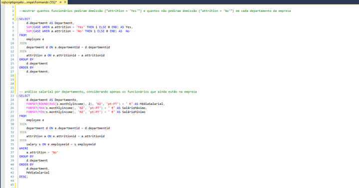
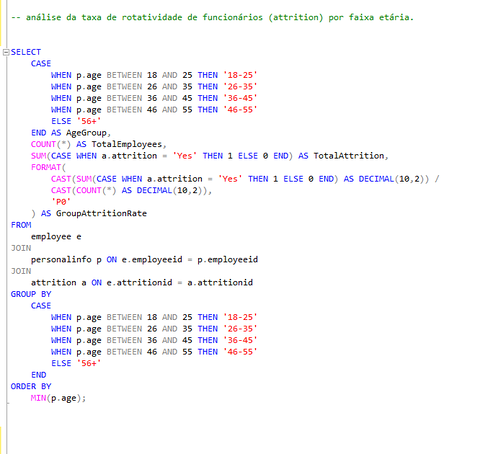
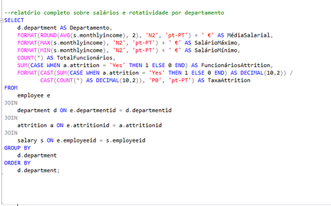
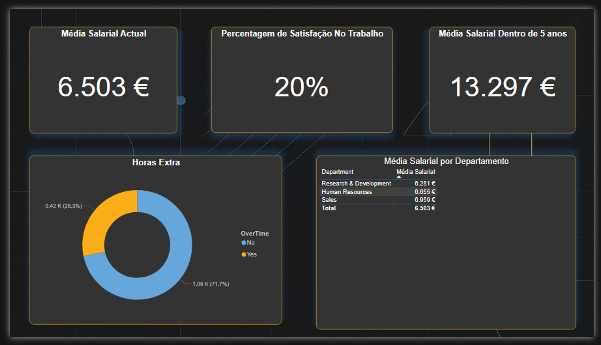

# Análise de Atrito e Desempenho de Funcionários - HR Analytics

<div align="center">
  
  
  <p>
    
    
    
  </p>
</div>

## 📑 Índice

- [Sobre o Projeto](#-sobre-o-projeto)
- [Objetivos](#-objetivos)
- [Principais Insights](#-principais-insights)
- [Estrutura do Projeto](#-estrutura-do-projeto)
- [Metodologia](#-metodologia)
- [Análises Realizadas](#-análises-realizadas)
- [Visualizações e Dashboards](#-visualizações-e-dashboards)
- [Documentos do Projeto](#-documentos-do-projeto)
- [Tecnologias Utilizadas](#-tecnologias-utilizadas)
- [Estrutura de Diretórios](#-estrutura-de-diretórios)
- [Como Utilizar](#-como-utilizar)
- [Conclusões Principais](#-conclusões-principais)
- [Licença](#-licença)

## 📊 Sobre o Projeto

Este projeto de HR Analytics tem como objetivo analisar os fatores que influenciam a rotatividade (atrito) e o desempenho dos funcionários numa organização. Utilizando técnicas de análise de dados, modelação estatística e visualização, procuramos identificar padrões e insights que possam auxiliar na tomada de decisões estratégicas de recursos humanos.

## 🎯 Objetivos

- Identificar os principais fatores que contribuem para o atrito de funcionários
- Analisar o desempenho dos colaboradores em diferentes departamentos
- Criar modelos preditivos para antecipar possíveis saídas de talentos
- Fornecer recomendações baseadas em dados para melhorar a retenção de talentos
- Desenvolver dashboards interativos para monitorização contínua de métricas de RH

## 💡 Principais Insights

<div style="display: flex; justify-content: space-around; flex-wrap: wrap; margin: 20px 0;">
  <div style="flex: 0 0 30%; background-color: #f0f7ff; padding: 15px; border-radius: 10px; box-shadow: 0 4px 8px rgba(0, 0, 0, 0.1); margin-bottom: 20px; text-align: center;">
    <h3>🔍 Fatores de Atrito</h3>
    <p>Horas extraordinárias aumentam em <b>3x</b> a probabilidade de saída</p>
  </div>
  <div style="flex: 0 0 30%; background-color: #fff0f0; padding: 15px; border-radius: 10px; box-shadow: 0 4px 8px rgba(0, 0, 0, 0.1); margin-bottom: 20px; text-align: center;">
    <h3>📊 Departamentos</h3>
    <p>Vendas e TI apresentam <b>25%</b> mais rotatividade que outros departamentos</p>
  </div>
  <div style="flex: 0 0 30%; background-color: #f0fff0; padding: 15px; border-radius: 10px; box-shadow: 0 4px 8px rgba(0, 0, 0, 0.1); margin-bottom: 20px; text-align: center;">
    <h3>⏱️ Tempo na Empresa</h3>
    <p>Funcionários sem promoção após <b>2 anos</b> têm maior risco de saída</p>
  </div>
</div>

## 📋 Estrutura do Projeto

### Dados

O projeto utiliza um conjunto de dados de RH com informações sobre:

- Dados demográficos dos funcionários
- Histórico de desempenho
- Satisfação no trabalho
- Tempo na empresa
- Departamentos e funções
- Compensação e benefícios

### Modelação de Dados

<details>
<summary><b>Modelo OLTP (Transacional)</b></summary>
<div align="center">
  
</div>
</details>

<details>
<summary><b>Modelo OLAP (Analítico)</b></summary>
<div align="center">
  
</div>
</details>

<details>
<summary><b>Dicionário de Dados</b></summary>
<div align="center">
  
</div>
</details>

## � Metlodologia

<div style="background-color: #f9f9f9; padding: 20px; border-radius: 10px; margin: 20px 0;">
  <p>Este projeto seguiu uma metodologia estruturada de análise de dados para recursos humanos:</p>
  
  <ol>
    <li><strong>Recolha e Preparação de Dados</strong>: Extração de dados de RH de múltiplas fontes, limpeza e normalização</li>
    <li><strong>Análise Exploratória</strong>: Identificação de padrões, correlações e outliers nos dados</li>
    <li><strong>Modelação Estatística</strong>: Aplicação de técnicas de regressão e classificação para identificar fatores de atrito</li>
    <li><strong>Visualização</strong>: Criação de dashboards interativos para comunicar resultados</li>
    <li><strong>Recomendações</strong>: Desenvolvimento de estratégias baseadas em dados para reduzir o atrito</li>
  </ol>
  
  <p>A análise foi realizada utilizando SQL para consultas complexas, R para análise estatística avançada e Power BI para visualizações interativas.</p>
</div>

## 🔍 Análises Realizadas

### Consultas SQL

<div style="display: flex; justify-content: space-between; flex-wrap: wrap;">
  <div style="flex: 0 0 48%; margin-bottom: 20px;">
    <h4>Consulta 1</h4>
    
  </div>
  <div style="flex: 0 0 48%; margin-bottom: 20px;">
    <h4>Consulta 2</h4>
    
  </div>
</div>

### Joins e Análises Relacionais

<details>
<summary><b>Análise por Departamento</b></summary>
<div align="center">
  
</div>
</details>

<details>
<summary><b>Análise de Informações Pessoais</b></summary>
<div align="center">
  
</div>
</details>

<details>
<summary><b>Análise de Rotatividade</b></summary>
<div align="center">
  
</div>
</details>

### Transformação de Dados

<div align="center">
  
</div>

## 📊 Visualizações e Dashboards

<div style="display: flex; justify-content: space-between; flex-wrap: wrap; margin-top: 20px;">
  <div style="flex: 0 0 48%; margin-bottom: 20px;">
    <h3 align="center">Dashboard Principal</h3>
    
  </div>
  <div style="flex: 0 0 48%; margin-bottom: 20px;">
    <h3 align="center">Dashboard de Métricas Detalhadas</h3>
    
  </div>
</div>

## 📈 Documentos do Projeto

<div style="display: flex; justify-content: space-around; flex-wrap: wrap; margin: 30px 0;">
  <div style="flex: 0 0 45%; background-color: #f8f9fa; padding: 20px; border-radius: 10px; box-shadow: 0 4px 8px rgba(0, 0, 0, 0.1); margin-bottom: 20px;">
    <h3 align="center">📊 Apresentação PowerPoint</h3>
    <div align="center">

      <div style="display: flex; justify-content: center; gap: 10px; flex-wrap: wrap;">
        <a href="Documentação/CA_AiDAPT01_P1_Apresentacao_Final.pdf" target="_blank" style="display: inline-block; background-color: #DC3545; color: white; padding: 8px 16px; text-align: center; text-decoration: none; border-radius: 5px; margin: 5px;">
          <b>📄 Ver PDF Completo</b>
        </a>
        <a href="Documentação/CA_AiDAPT01_P1_Apresentacao_Final.pptx" download style="display: inline-block; background-color: #B7472A; color: white; padding: 8px 16px; text-align: center; text-decoration: none; border-radius: 5px; margin: 5px;">
          <b>⬇️ Descarregar PPT</b>
        </a>
      </div>
    </div>
  </div>
  
  <div style="flex: 0 0 45%; background-color: #f8f9fa; padding: 20px; border-radius: 10px; box-shadow: 0 4px 8px rgba(0, 0, 0, 0.1); margin-bottom: 20px;">
    <h3 align="center">📑 Relatório de Análise em R</h3>
    <div align="center">
      <p>Análise estatística avançada incluindo exploração de dados, testes de hipóteses, modelação preditiva e visualizações.</p>
      <a href="Documentação/CA_AiDAPT01_P1_Analise_em_R.pdf" target="_blank" style="display: inline-block; background-color: #276DC3; color: white; padding: 10px 20px; text-align: center; text-decoration: none; border-radius: 5px; margin: 10px 0;">
        <b>📄 Ver Relatório Completo</b>
      </a>
    </div>
  </div>
</div>

## 🛠️ Tecnologias Utilizadas

<div style="display: flex; justify-content: space-around; flex-wrap: wrap; margin: 20px 0;">
  <div style="text-align: center; margin: 10px;">
    <a href="https://www.microsoft.com/sql-server" target="_blank" rel="noopener noreferrer">
      
    </a>
    <p>Armazenamento de Dados</p>
  </div>
  <div style="text-align: center; margin: 10px;">
    <a href="https://www.mongodb.com/" target="_blank" rel="noopener noreferrer">
      
    </a>
    <p>Armazenamento NoSQL</p>
  </div>
  <div style="text-align: center; margin: 10px;">
    <a href="https://www.r-project.org/" target="_blank" rel="noopener noreferrer">
      
    </a>
    <p>Análise Estatística</p>
  </div>
  <div style="text-align: center; margin: 10px;">
    <a href="https://powerbi.microsoft.com/" target="_blank" rel="noopener noreferrer">
      
    </a>
    <p>Visualização de Dados</p>
  </div>
</div>

## 📁 Estrutura de Diretórios

```
📦 HR-Analytics-Project
 ┣ 📂 Código
 ┃ ┣ 📜 CA_AiDAPT01_P1_MongoDB.docx
 ┃ ┣ 📜 CA_AiDAPT01_P1_Script_Original_Projeto.sql
 ┃ ┣ 📜 CA_AiDAPT01_P1_Scripts_MongoDB.txt
 ┃ ┗ 📜 CA_AiDAPT01_P1_report _corr.Rmd
 ┣ 📂 Dados
 ┃ ┣ 📜 CA_AiDAPT_Dicionario_de_dados.xlsx
 ┃ ┗ 📜 CA_AiDAPT_Normalizacao_Final.xlsx
 ┣ 📂 Documentação
 ┃ ┣ 📜 CA_AiDAPT01_P1_Analise_em_R.pdf
 ┃ ┣ 📜 CA_AiDAPT01_P1_Apresentacao_Final.pptx
 ┃ ┗ 📜 CA_AiDAPT01_P1_ibm_hr_data.csv
 ┣ 📂 Imagens
 ┃ ┣ 📜 CA_AiDAPT01_P1_Dados_Apos_Transformacoes.png
 ┃ ┣ 📜 CA_AiDAPT01_P1_Dicionario_Dados.png
 ┃ ┣ 📜 CA_AiDAPT01_P1_OLAP_Diagrama.png
 ┃ ┣ 📜 CA_AiDAPT01_P1_OLTP_Diagrama.png
 ┃ ┣ 📜 CA_AiDAPT01_P1_Script_SQL_Consulta_1.png
 ┃ ┣ 📜 CA_AiDAPT01_P1_Script_SQL_Consulta_2.png
 ┃ ┣ 📜 CA_AiDAPT01_P1_Script_SQL_Joins_Pepartamento.png
 ┃ ┣ 📜 CA_AiDAPT01_P1_Script_SQL_Joins_Personalinfo.png
 ┃ ┣ 📜 CA_AiDAPT01_P1_Visualizacao_Dashboard_1.png
 ┃ ┣ 📜 CA_AiDAPT01_P1_Visualizacao_Dashboard_2.png
 ┃ ┗ 📜 CA_AiDAPT01_P1_script4_SQL._joins_Rotatividadepng.png
 ┗ 📂 Visualizações
   ┗ 📜 CA_AiDAPT01_P1_Power_BI.pbix
```

## 🚀 Como Utilizar

<div style="background-color: #f8f9fa; padding: 15px; border-radius: 8px; margin: 20px 0;">
  <ol>
    <li>Clone este repositório: <code>git clone https://github.com/MrMaddball/BM-HR-Analytics-Employee-Attrition-Performance.git</code></li>
    <li>Explore os scripts SQL na pasta <code>Código</code></li>
    <li>Analise os dados brutos na pasta <code>Dados</code></li>
    <li>Consulte a documentação na pasta <code>Documentação</code></li>
    <li>Abra os dashboards Power BI na pasta <code>Visualizações</code></li>
  </ol>
</div>

## 📝 Conclusões Principais

<div style="background-color: #f0f7ff; padding: 15px; border-radius: 8px; margin: 20px 0;">
  <ul>
    <li>Identificámos que fatores como distância de casa, horas extraordinárias e satisfação no trabalho são determinantes para o atrito de funcionários</li>
    <li>Departamentos com maior rotatividade: Vendas e TI</li>
    <li>Funcionários com mais de 2 anos na empresa e sem promoção recente apresentam maior risco de saída</li>
    <li>Implementação de programas de reconhecimento e planos de carreira claros podem reduzir significativamente o atrito</li>
  </ul>
</div>


## 📄 Licença

Este projeto é para fins educacionais e de demonstração.

<div style="background-color: #f8f8f8; padding: 15px; border-radius: 8px; margin: 20px 0; font-size: 0.9em;">
  <p><strong>Nota:</strong> Os dados utilizados neste projeto foram anonimizados e modificados para proteger informações sensíveis. Qualquer semelhança com dados reais é mera coincidência.</p>
</div>

---

<div align="center">
  <p>Para mais informações, contacte através do GitHub.</p>
  <a href="https://github.com/MrMaddball" style="display: inline-block; background-color: #24292e; color: white; padding: 8px 16px; text-align: center; text-decoration: none; border-radius: 5px; margin: 10px 0;">
    
  </a>
</div>
